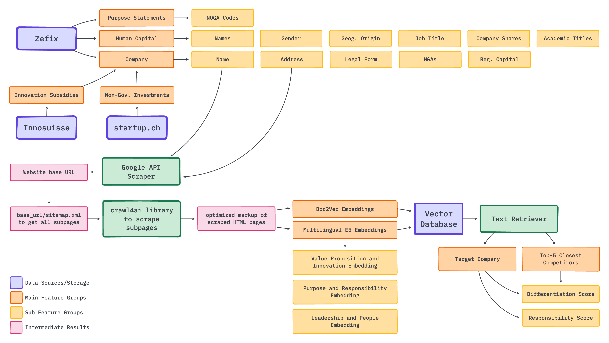

# Automated Venture Capitalist: Text-Based Prediction of Early-Stage Startup Success from Public Data

This repository contains the code for the master thesis "Automated Venture Capitalist: Text-Based Prediction of Early-Stage Startup Success from Public Data". The thesis aims to improve early-stage startup success prediction by combining administrative company data with website-derived strategic measures. I train binary classifiers to forecast four key startup outcomes within five years of founding:

- Involuntary exit (e.g., bankruptcy or liquidation)
- Acquisition by another firm
- Private investment (e.g., IPOs, venture capital)
- Innovation subsidies granted by Innosuisse, the Swiss innovation agency

The dataset includes approximately 110,000 Swiss startups founded between 2016 and 2020. This work demonstrates how publicly available web and registry data can be used to build scoring models to support the screening of newly founded firms and show that founding strategy matters for the outcome prediction.



## Project Structure

- **data/**
    - **raw/** and **processed/**: Contain store raw and preprocessed data from:
        - [Zefix](https://www.zefix.ch/en/search/entity/welcome)
        - [ARAMIS](https://www.aramis.admin.ch/Projektsuche/?Sprache=en-US)
        - [Startup.ch](https://www.startup.ch/)
        - Company Websites
        - Additional External Sources used for feature engineering
- **docs/**
    - **thesis/**: Paper.
    - **presentation/**: Thesis presentation slides.
- **models/**
    - Stores trained models, hyperparameter and evaluation metrics reports.
- **notebooks/**
    - **one-off analyses/**: Summary statistics for thesis and data preparation.
- **reports/**
    - **figures/**: Figures from the thesis / summary_statistics.ipynb.
- **success_prediction/**
    - Source code for crawling, feature engineering, training, and evaluating models.
    - Main score calculation script: **run_create_embedding_scores.sh**
    - Main experiment script: **run_all_experiments.sh**

## Project setup and dependencies

This project uses [PEP 621](https://packaging.python.org/en/latest/specifications/declaring-project-metadata/) and [`pyproject.toml`](https://flit.readthedocs.io/en/latest/pyproject_toml.html) for dependency management, with [Flit](https://flit.readthedocs.io/) as the build backend.

1. **Install Flit if you don’t have it:**

    ```bash
    pip install flit
    ```

**Create a new virtual environment (assuming Python 3.12):**

    ```bash
    python3.12 -m venv .venv
    source .venv/bin/activate
    ```

**Install all dependencies and the package itself:**

    ```bash
    flit install --symlink
    ```

    - Use `--symlink` for development (editable) installs; omit it for a regular install.

## Usage

1. **Source Data and Access**  
    Processed files are provided in: `data/processed/`.
    Some files are too large to be hosted on GitHub, such as the raw website files and company sample files.
    Access to these can be given on request.

2. **Run scripts**  

    1. Make sure to be in the correct folder

        ```bash
        cd success_prediction
        ```

    2. Scrape company urls

        ```bash
        python scrape_company_urls.py
        ```

    3. Crawl scraped urls

        ```bash
        python scrape_company_websites.py  # For current websites
        python scrape_company_websites.py --wayback  # For founding websites
        ```

    4. Create embeddings and scores from the scraped website content

        ```bash
        bash run_create_embedding_scores.sh
        ```

        This will run the creation of the following embedding types and scores for current and wayback websites:
        - Trains and runs Doc2Vec
        - Multilingual E5 embeddings and scores

    5. Run all experiments, including model training, hyperparameter optimization, and various evaluations

        ```bash
        bash run_all_experiments.sh
        ```

        This will run the full model training for all three experiments:
        - Experiment A: Performance difference between different model types on baseline features (replication experiment)
        - Experiment B: Regression Analysis of Embedding Scores
        - Experiment C: Estimate predictive value of website features


3. **Review results**

    - Evaluation reports can be found in models/.
    - Result presentation is in docs/.


## Author
Manuel Bolz | manuel.bolz@business.uzh.ch
